# ThoughtWorks Test (twt) - Um exercício do processo seletivo sobre Pipeline as Code

Este repositório é sobre a implementação de uma pipeline simples para ci/cd que realize build, testes unitários, verificação de qualidade de código e deploy preferencialmente em containers.

Para aplicação, optei por utilizar uma biblioteca open source feita em NodeJS chamada ``hapi``, a qual funciona como uma framework de construção simplificada de aplicações e serviços. A nossa pipeline utiliza os sources do ``hapi`` como base para execução dos testes unitários e a análise de qualidade, ao final o artefato construído é a imagem docker de um servidor web já configurado e com algumas rotas de validação.

O processo se resume nos seguintes estágios:

* Inicialização (variávies e tools)
* Code checkout (hapi)
* Build de dependências (npm)
* Execução de testes unitários
* Análise de qualidade de código (sonarqube)
* Criação de artefato (Imagem Docker)
* Push do artefato (Imagem docker) para repositório (Docker Hub)
* Pull e execução do container com aplicação (http://localhost:3000)

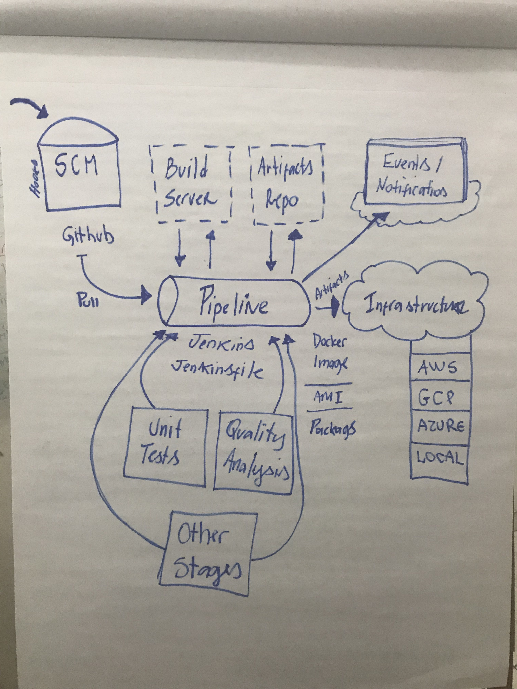

--------------------------- 

## Primeiros passs - Estabelecendo os serviços

Agora que já estamos alinhados quanto ao projeto e os estágios da pipeline, vamos as configurações!

Para este exerícicio assim como na vida, podemos escolher escolher entre configurar todo ambiente e suas penedências ou utilizar containers docker já totalmente configurados e disponíveis no docker hub. Por razões obvias vamos seguir utilizando containers e para isso você precisa apenas ter o servico do Docker instalado na sua máquina ou servidor. S

Seguem abaixo os links para download e passo-a-passo sobre como instala-lo considerando o seu sistema operacional de preferência:


**MacOS**

Instalação: https://docs.docker.com/docker-for-mac/install/#install-and-run-docker-for-mac
Download: https://store.docker.com/editions/community/docker-ce-desktop-mac


**Linux**

Instalação: https://docs.docker.com/install/linux/docker-ce/ubuntu/
(veja outras distribuições no menu lateral)

**Windows**

Instalação: https://docs.docker.com/docker-for-windows/install/
Download: https://store.docker.com/editions/community/docker-ce-desktop-mac


## Construção dos Servidores - Jenkins e SonarQube

Pronto, agora que você já tem o serviço do Docker instalado, partiremos para a consrução dos servidores principais do nosso exercício a partir de containers. Utilizaremos o Jenkins como orquestrador, logo será também nele aonde vamos configurar nossas pipelines e integrar com outros serviços. Outro componente importante da nossa estrutura é o SonarQube, ferramenta que realize o code analysis e verifica a qualidade do código que está sendo entregue para os ambientes.


Então vamos começar! Você pode optar por instalar ambos containers "na mão", ou seja, puxando as imagens diretamente do Docker Hub e executando, ou talvez até mesmo criar um arquivo docker-compose (yaml) por conta própria, mas para este exemplo o ideal é seguir os arquivos já disponibilizados aqui no projeto. 

Este são os nossos construtores, para executalos basta acessar a pasta ```docker``` em nosso projeto e rodar o comando ```sh up.sh```

Uma outra opção é executar o comando abaixo a partir do mesmo diretório e teremos a mesma mágica acontecendo.
```
docker-compose -f docker-compose.yml up --build -d
```

Escolha o método de sua preferência e vamos adiante! Lembrando que é necessário executar apenas uma das opções (sh up.sh ou docker-compose).


``docker-compose.yml``
```yml
version: '3.2'
services:
  sonarqube:
    build:
      context: sonarqube/
    ports:
      - 9000:9000
      - 9092:9092
    container_name: sonarqube
  jenkins:
    build:
      context: jenkins/
    privileged: true
    user: root
    ports:
      - 8080:8080
      - 50000:50000
    container_name: jenkins
    volumes:
      - /tmp/jenkins:/var/jenkins_home
      - /var/run/docker.sock:/var/run/docker.sock
    depends_on:
      - sonarqube
```

Paths e conteúdo dos arquivos Dockerfile responsáveis pela construção dos containers no momento da execução do docker-compose.

``sonarqube/Dockerfile``
```
FROM sonarqube:6.7-alpine
```

``jenkins/Dockerfile``
```
FROM jenkins:2.60.3-alpine
```


Uma vez executado, devemos conferir o resultado e checar se nossos containers estão rodando corretamente:


```
docker ps

CONTAINER ID        IMAGE                COMMAND                  CREATED              STATUS              PORTS                                              NAMES
cdc2ff18731b        docker_jenkins     "/bin/tini -- /usr..."   About a minute ago   Up About a minute   0.0.0.0:8080->8080/tcp, 0.0.0.0:50000->50000/tcp   jenkins
0da5facb15fe        docker_sonarqube   "./bin/run.sh"           About a minute ago   Up About a minute   0.0.0.0:9000->9000/tcp, 0.0.0.0:9092->9092/tcp     sonarqube
```


## Configuração do GitHub (Opcional)

Para este exercício não vamos configurar webhooks uma vez que o Jenkins esta rodando local e isso criaria uma dependências com a suas configurações de rede/internet, no entanto vale ressaltar que em um contexto de produção isso seria bastante indicado e coloca ainda mais automação no contexto - a partir de um push no repositório ele já executa a pipeline, top hein ? :)

Para configurar os hooks basta abrir o repositório no Github e ir em Settings -> Integrations & Services > Add Service > Jenkins (Github plugin) e configurar, passando o endereço no formato http://seu-servidor-jenkins/github-webhook/ .

Talvez seja necessário também criar uma chave SSH e adicionar no ``Deploy keys`` no seu repositório GitHub como indicado abaixo.


## Inicialização do Jenkins

Esta sim é uma parte fundamental do exercício, uma vez que temos o container Jenkins rodando, ele pode ser acessado pelo endereço http://localhost:8080 de acordo com as configurações descritas no docker compose. 

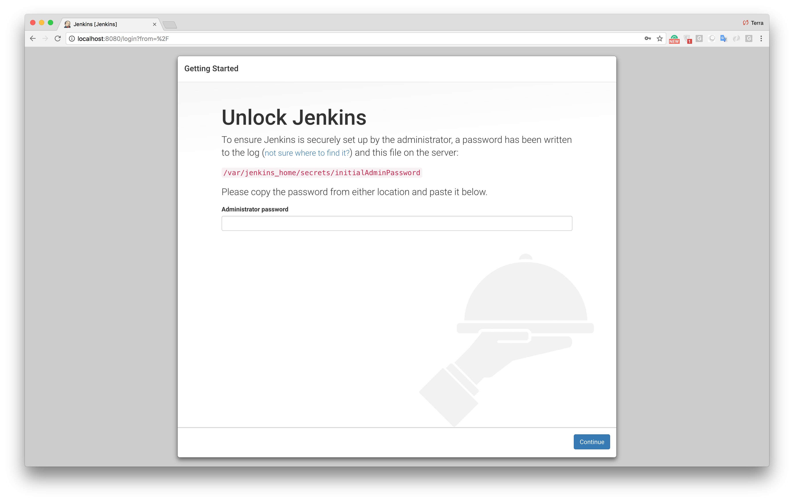

Será necessário a senha de administrador para seguir na instalação. Ela fica armazenada no arquivo ``/var/jenkins_home/secrets/initialAdminPassword``, mas também é exibida como output do processo de inicialização do Jenkins.

Para acessar a chave basta executar o comando abaixo:

```
docker logs jekins
```

```
jenkins      | *************************************************************
jenkins      |
jenkins      | Jenkins initial setup is required. An admin user has been created and a password generated.
jenkins      | Please use the following password to proceed to installation:
jenkins      |
jenkins      | 45638c79cecd4f43962da2933980197e
jenkins      |
jenkins      | This may also be found at: /var/jenkins_home/secrets/initialAdminPassword
jenkins      |
jenkins      | *************************************************************
```

Depois de fornecer o password será necessário instalar os plugins recomendados e definir um ``admin user``.

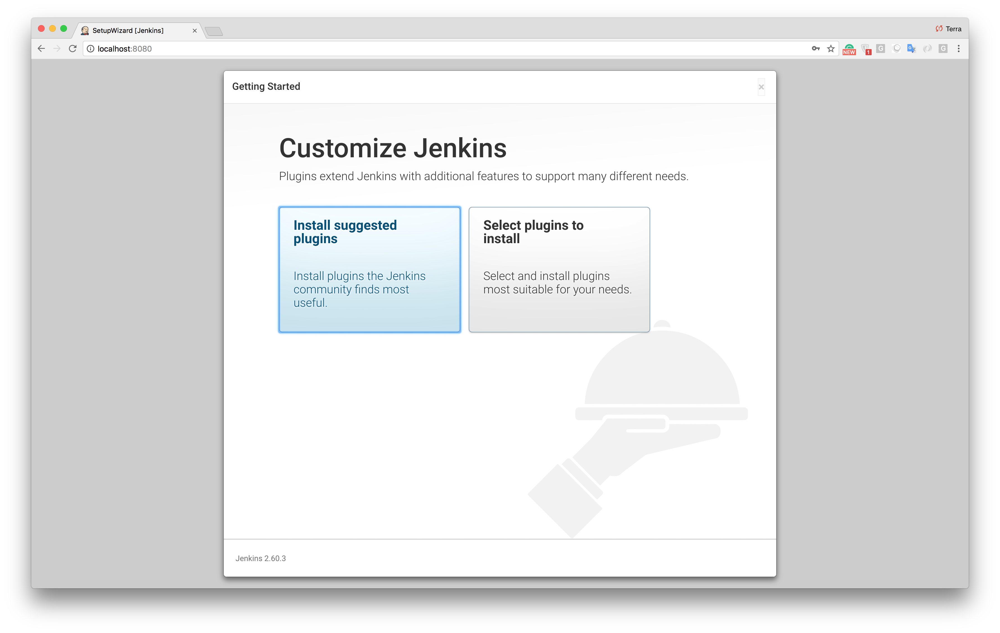


Depois de clicar nos botões **Save and Finish** e **Start using Jenkins**, você estará acessando o painel principal do Jenkins. Agora vamos começar o trabalho de configuração dos plugins e testes de integração.


## Configuração do Jenkins

Você pode optar por atualizar os Plugins do Jenkins e inclusive sua versão antes de dar início nas outras configurações, é uma boa prática e pode evitar problemas. 

Para o exercício precisaremos instalar um novo plugin chamado ``SonarQube Scanner for Jenkins``, para isso selecione no menu lateral a opção ``Gerenciar Jenkins -> Gerenciar Plugins -> Disponíveis`` e pesquisar:

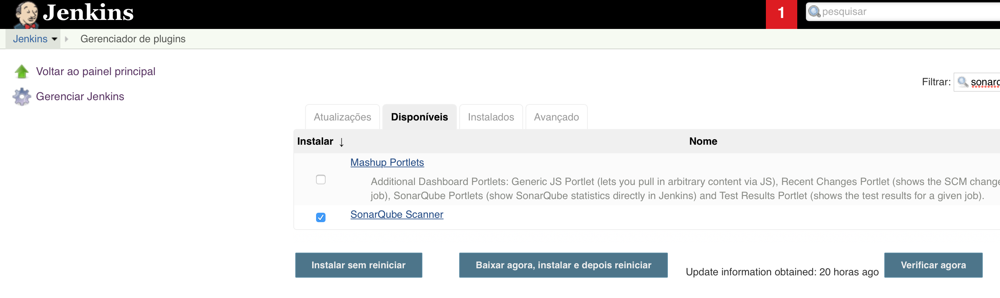

Uma vez instalado e reiniciado, vamos as configurações, para isso precisaremos acessar o menu ``Gerenciar Jenkins -> Global Configuration Tools``:


Primeiro, configuramos o SonarQube Scanner:
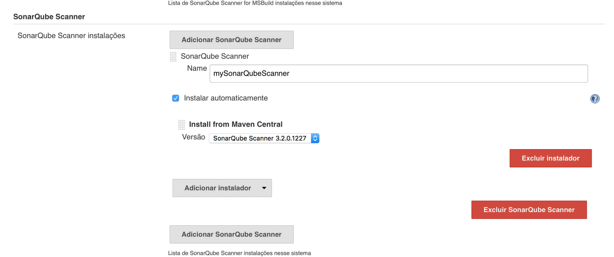


Em seguida o Docker:
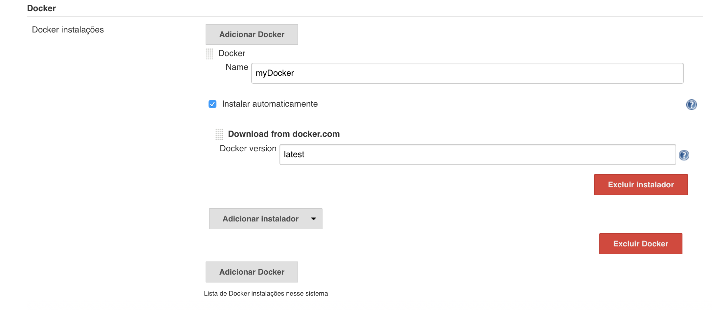


Agora vamos definir o SonarQube server em ``Gerenciar Jenkins -> Configure System``:
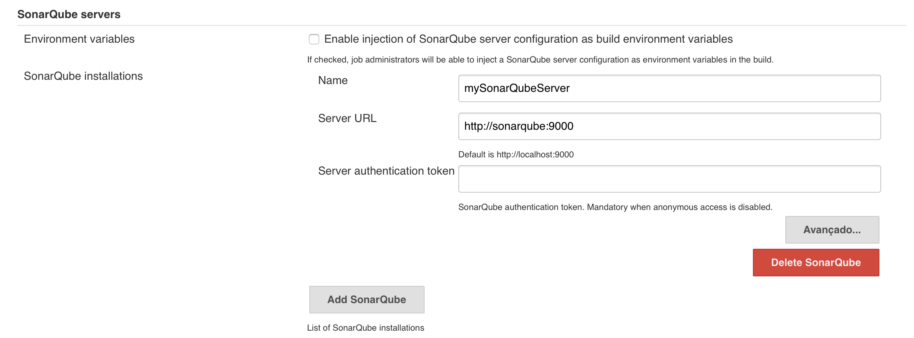


Última parte, mas não menos importante que é a configuração de credenciais. Este step é fundamental para que possamos enviar as imagens docker geradas pelas pipelines para o repositório Docker Hub. Basta acessar no menu ``Credentials -> Global -> Add Credential``:

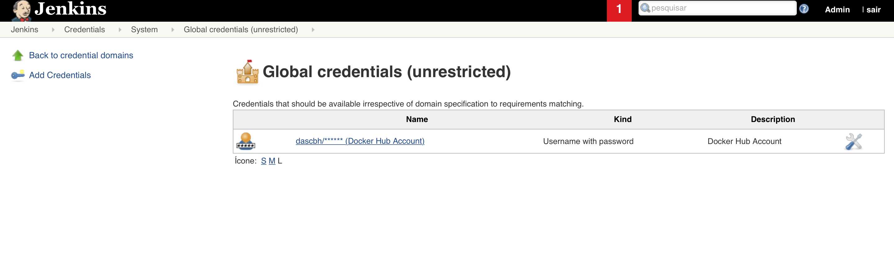
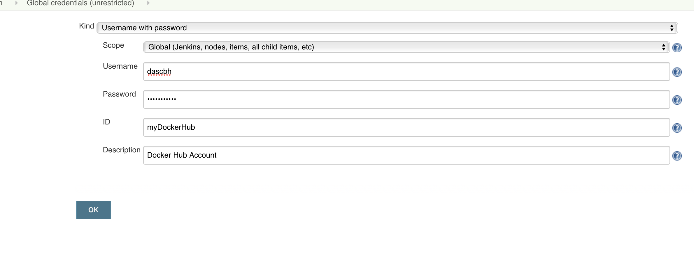


Pronto! Todas as configurações necesárias para executar nossa pipeline já foram feitas, agora vamos a parte final que é a criação e execução.


## Setup da Pipeline
Na página principal do Jenkins, vamos criar um Novo job e realizar a parametriação. O primeiro passo é criar o job, vamos lá ? Clique em Novo job:

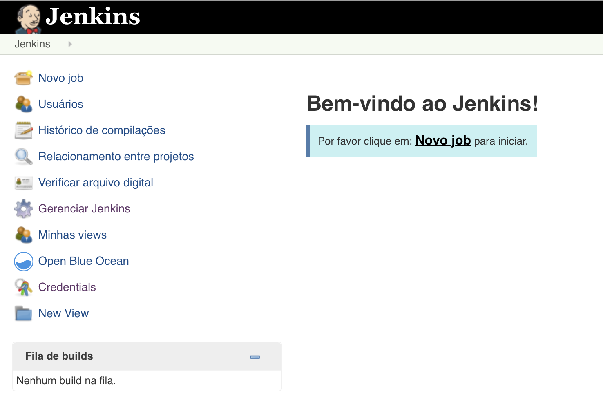


Defina um nome (geralmente seguindo o padrão do projeto) e selecione o tipo ``Pipeline``

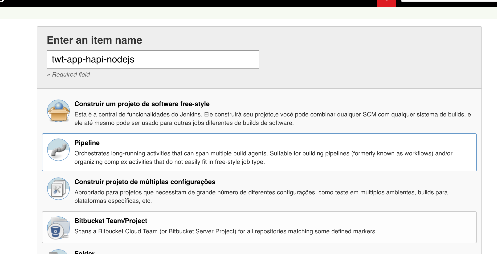


Na seção General, marque a opção ``GitHub Project`` e coloque o endereço do projeto no GitHub. Na seção Build Triggers marque também a opção ``GitHub hook trigger for GITScm polling``, desta forma sua pipepline já fica pronta para execucar automaticamente caso você tenha feito a configuração de webhook no repositório.

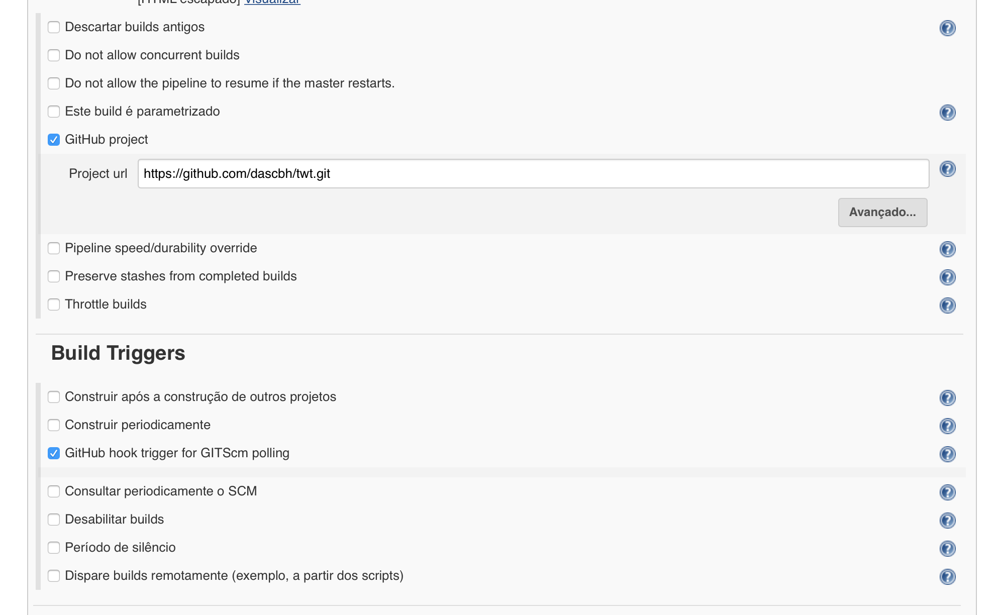


Agora na seção ``Advanced Project Options``, no campo Definition selecione ``Pipeline script form SCM``, com isso o Jenkins assumira que seu script de pipeline estará dentro do projeto. Desta forma, será necessário informar qual é o ``SCM`` (no caso Git), o ``Repository URL`` passando novamente o endereço do projeto, e por fim o ``Script path`` que por padrão já é Jenkinsfile.

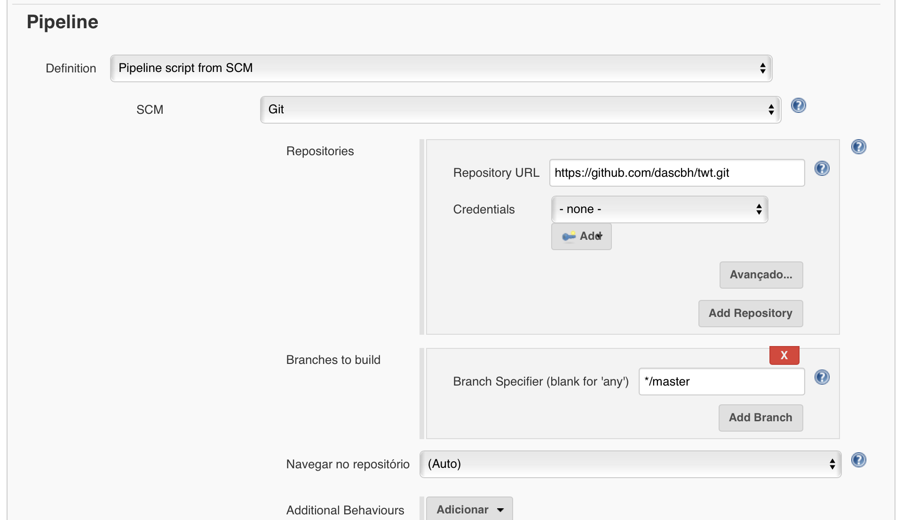


Pronto! Sua nova pipeline está pronta para ser executada. 

Uma vez iniciada você poderá acompanhar a evolução pelo link do job ``http://localhost:8080/job/twt-app-hapi-nodejs/``. 

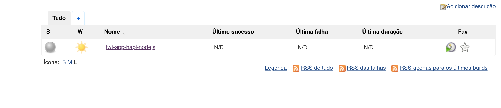


Assim que todos os estágios forem conclúidos com sucesso você poderá validar acessando via browser o container que foi criado com nossa aplicação teste pelo do endereço: 

```
http://localhost:3000/
```

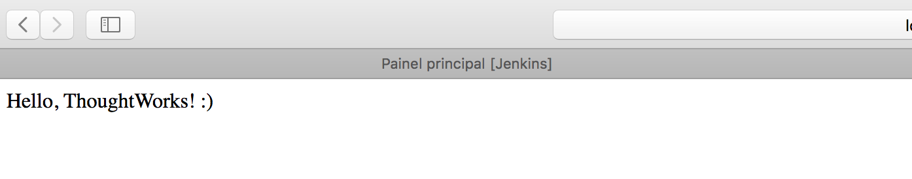


Não deixe de conferir também o funcionamento do container de aplicação que foi criado.

```
docker ps

CONTAINER ID        IMAGE                COMMAND                  CREATED              STATUS              PORTS                                              NAMES
d9ada886d2d7        dascbh/twt-app:latest   "node app.js"            3 minutes ago       Up 4 minutes              0.0.0.0:3000->3000/tcp                             twt-app
```


# Obrigado
